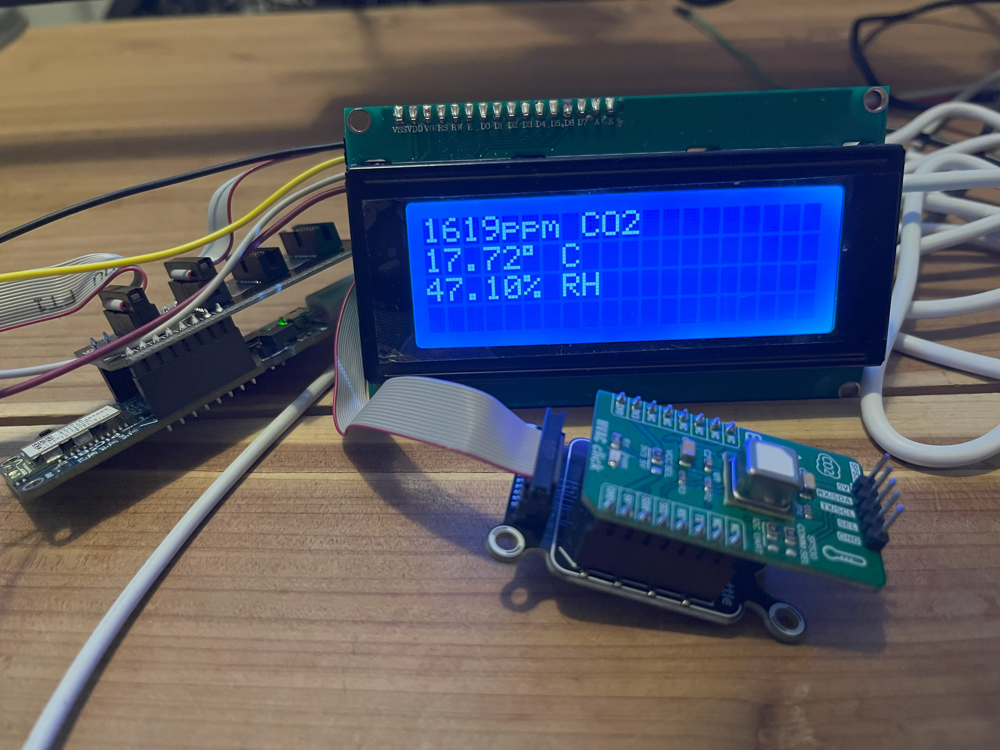

# OctavianOrg.Beemon
Embedded project using the Microchip PIC-BLE development board for monitoring temperature, humidity and CO2 levels in a beehive.

Keeping colonies alive over the winter in the PNW is a challenge. Varroa, condensation and cold are just some of the problems. This project is an
attempt to monitor some of these conditions when opening the hive is not an option.

[PIC-BLE dev board](https://www.microchip.com/en-us/development-tool/dt100112)

[CO2/Temp/Humid click board](https://www.mikroe.com/hvac-click)

[LCD screen](https://wiki.keyestudio.com/Ks0062_keyestudio_I2C_LCD2004_Module)

The LCD screen is just for dev/debug purposes. It won't be part of the final project.

The PIC-BLE board also comes with a temperature sensor, authentication chip, 4MBit of serial flash, accelerometer and the bluetooth low energy module.
I found the temperature sensor to be inaccurate so I just use the temperature value coming out of the Sensirion device on the HVAC click board. I have no
use for the auth/accel features so turn those off. The idea is that the measurements will be collected and stored on the local flash, which I can then
fetch over BLE. The demo application for this module was a helpful starting point, though I have had to make a large number of changes to how the
BLE messages get parsed and processed.

Original hope was to take measurements every 30 seconds or perhaps even less often, and sleep the processor in between to save power, but this caused
numerous problems during wakeup from a connecting bluetooth client. While there is an interrupt available for incoming UART data from the BLE module
to wake up the processor, there is no way to configure the module to send some dummy data first, and a bunch of the initial data from the module gets
lost. For now I will just have to use a larger power source to keep things running.

While the dev board does include a button battery slot on the back, the power draw from the CO2 sensor is too high.

Remaining work:

- Getting flash working via SPI, and periodically dumping measurements there.
- Design protocol to operate over the "transparent UART" in BLE module.
- Cleaning up unused cruft from the original demo app.

- 
